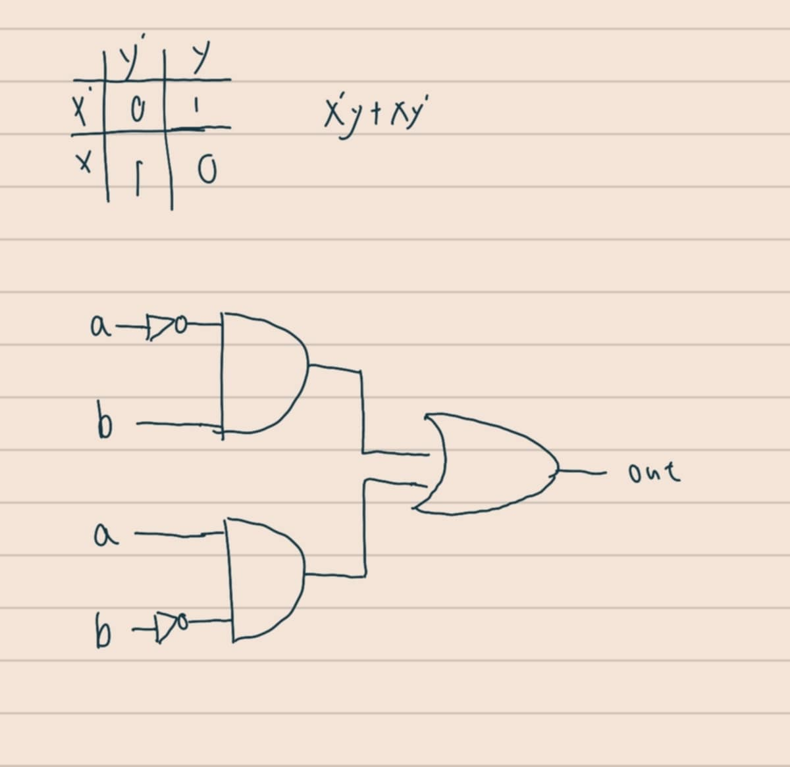
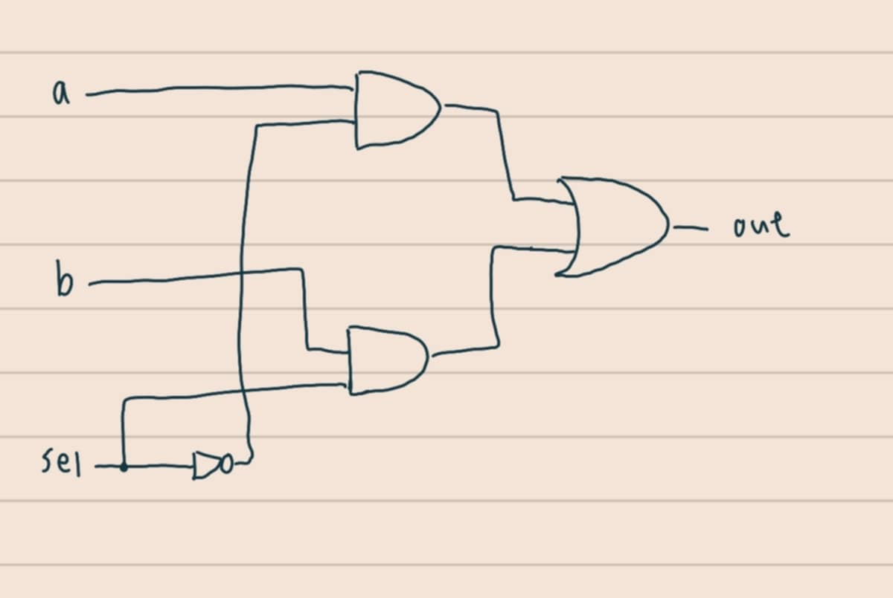

# ch1 習題
資工二 林彥廷
111210510
---
# 習題內容

NOT、AND、OR、XOR、Mux、DMux

NOT16、AND16、OR16、Mux16、OR8Way、Mux4Way16、Mux8Way16、DMux4Way、DMux8Way

# 關於作業

程式碼的部分獨立完成 電路圖有不會的部分參考網路資料

#　參考資料

<a href="https://www.nand2tetris.org/" target="_blank">From Nand to Tetris</a>

# 作業詳情

<a href="https://github.com/codewhight/_co/blob/master/01/Not.hdl" target="_blank">Not</a>

 

<a href="https://github.com/codewhight/_co/blob/master/01/And.hdl" target="_blank">And</a>

 

<a href="https://github.com/codewhight/_co/blob/master/01/Or.hdl" target="_blank">Or</a>

 

 <a href="https://github.com/codewhight/_co/blob/master/01/Xor.hdl" target="_blank">Xor</a>

 

 <a href="https://github.com/codewhight/_co/blob/master/01/Mux.hdl" target="_blank">Mux</a>

 

 <a href="https://github.com/codewhight/_co/blob/master/01/DMux.hdl" target="_blank">DMux</a>

 

 <a href="https://github.com/codewhight/_co/blob/master/01/Not16.hdl" target="_blank">Not16</a>

 

 <a href="https://github.com/codewhight/_co/blob/master/01/And15.hdl" target="_blank">And16</a>

 

 <a href="https://github.com/codewhight/_co/blob/master/01/Or16.hdl" target="_blank">Or</a>

 

 <a href="https://github.com/codewhight/_co/blob/master/01/Mux16.hdl" target="_blank">Mux16</a>

 

 <a href="https://github.com/codewhight/_co/blob/master/01/Or8Way.hdl" target="_blank">Or8Way</a>

 

 <a href="https://github.com/codewhight/_co/blob/master/01/Mux4Way16.hdl" target="_blank">Mux4Way16</a>

 

 <a href="https://github.com/codewhight/_co/blob/master/01/Mux8Way16.hdl" target="_blank">Mux8Way16</a>

 

 <a href="https://github.com/codewhight/_co/blob/master/01/DMux4Way16.hdl" target="_blank">DMux4Way16</a>

 

 <a href="https://github.com/codewhight/_co/blob/master/01/DMux8Way16.hdl" target="_blank">DMux8Way16</a>

 

 
