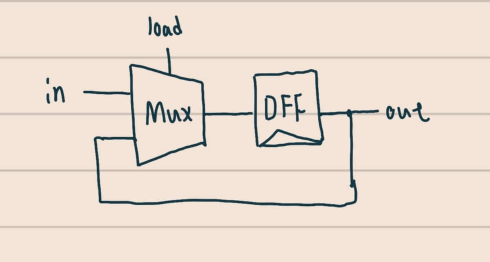
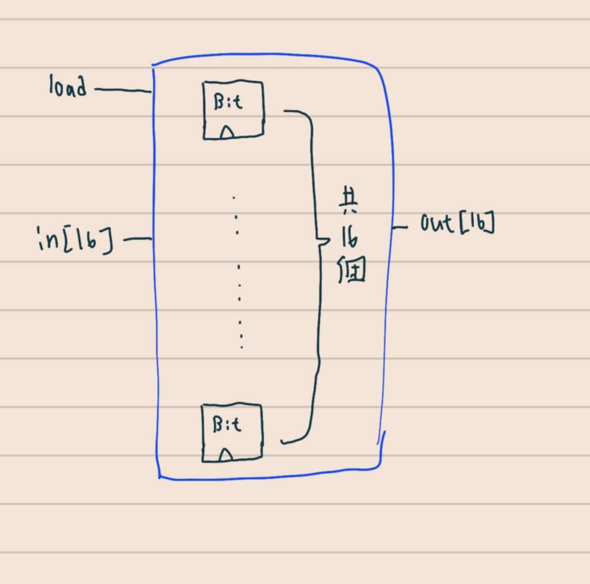
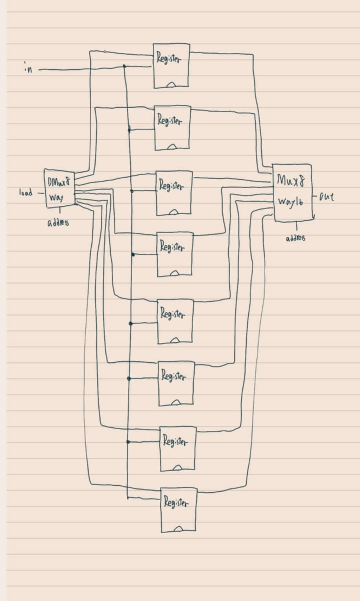
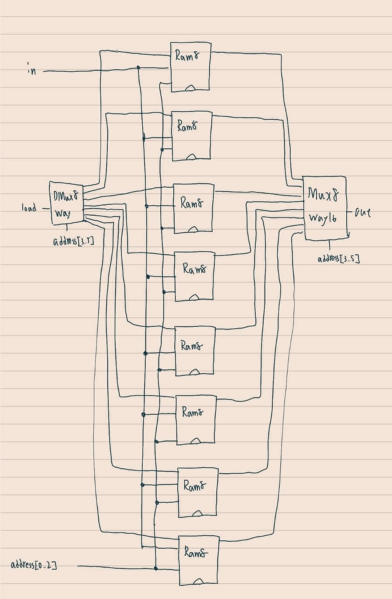
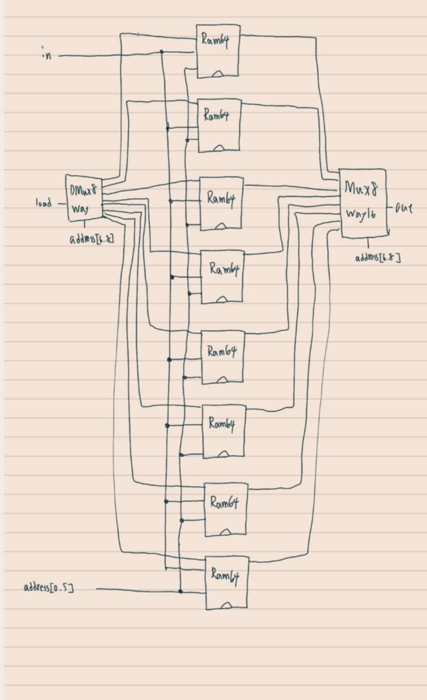
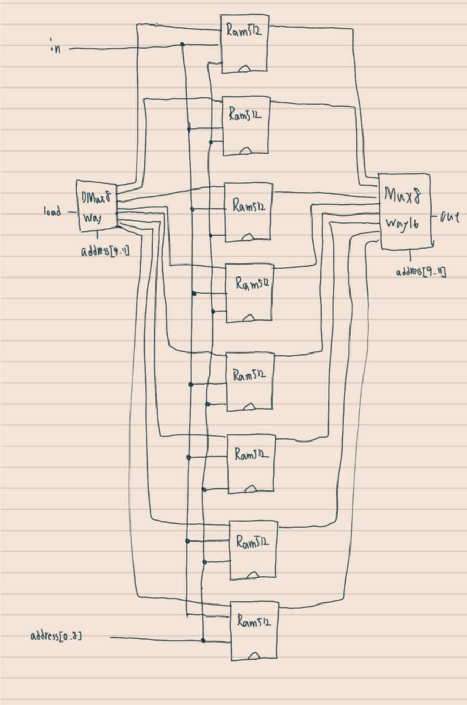
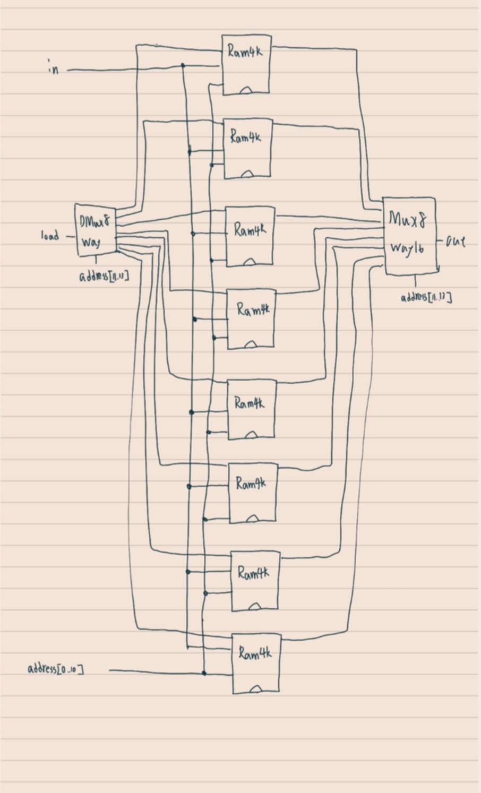
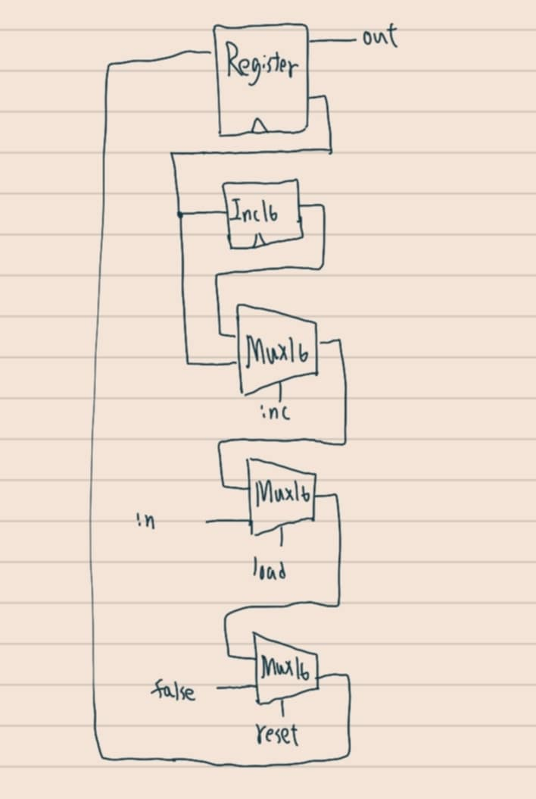

# ch3 習題
資工二 林彥廷
111210510
---
# 習題內容

Bit、Register、RAM8、RAM64

RAM512、RAM4K、RAM16K、PC

# 關於作業

程式碼的部分獨立完成 電路圖有不會的部分參考網路資料

先透過chatgpt大致了解 Bit、Register、RAM8、RAM64、RAM512、RAM4K、RAM16K 的功能和設計原理，畫出電路圖後，再進行習題的練習。

<a href="https://chatgpt.com/share/676c4028-3dbc-8012-bed0-9ed2d9b6501b" target="_blank">與chagpt的對話</a>

#　參考資料

<a href="https://www.nand2tetris.org/" target="_blank">From Nand to Tetris</a>

# 作業詳情

<a href="https://github.com/codewhight/_co/blob/master/03/a/Bit.hdl" target="_blank">Bit</a>

 

 <a href="https://github.com/codewhight/_co/blob/master/03/a/Register.hdl" target="_blank">Register</a>

 

 <a href="https://github.com/codewhight/_co/blob/master/03/a/RAM8.hdl" target="_blank">RAM8</a>

 

 <a href="https://github.com/codewhight/_co/blob/master/03/a/RAM64.hdl" target="_blank">RAM64</a>

 

 <a href="https://github.com/codewhight/_co/blob/master/03/b/RAM512.hdl" target="_blank">RAM512</a>

 

  <a href="https://github.com/codewhight/_co/blob/master/03/b/RAM4K.hdl" target="_blank">RAM4K</a>

 

  <a href="https://github.com/codewhight/_co/blob/master/03/b/RAM16K.hdl" target="_blank">RAM16K</a>

 

  <a href="https://github.com/codewhight/_co/blob/master/03/a/PC.hdl" target="_blank">PC</a>

 

p.s.
有使用chatgpt協助理解PC
<a href="https://chatgpt.com/share/676c2819-5964-8012-a0dd-72ac6a2ce6c3" target="_blank">與chatgpt的對話</a>

 
