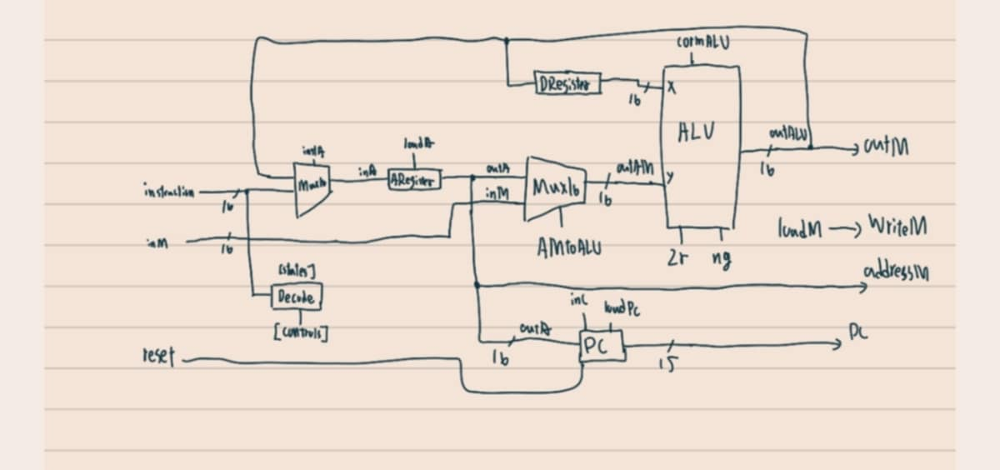
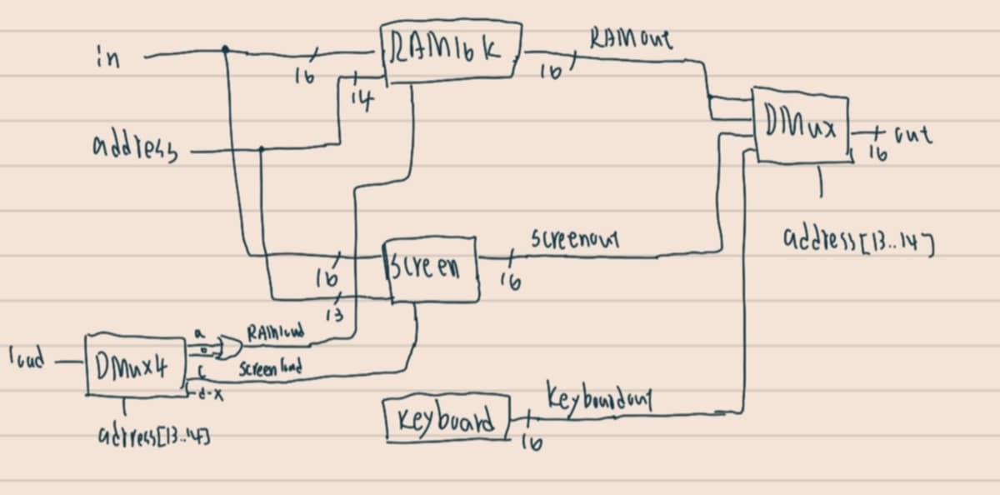

# ch5 習題
資工二 林彥廷
111210510
---
# 習題內容

CPU

Ｍemory Computer

# 關於作業
基本上參考網路上影片的教學，理解程度相對較低

CPU : 參考<a href="https://www.youtube.com/watch?v=CBeVn-RSavk&list=PLT4mIxZjQO1rTavJ5zelv_gr0rR7lkAwm&index=7&t=2999s" target="_blank">這個影片</a>  以及 <a href="https://www.nand2tetris.org/" target="_blank">From Nand to Tetris</a>協助完成

Memory : 參考 <a href="https://www.youtube.com/watch?v=ckYSlJtpXaE&list=PLT4mIxZjQO1rTavJ5zelv_gr0rR7lkAwm&index=6" target="_blank">這個影片</a>  以及 <a href="https://www.nand2tetris.org/" target="_blank">From Nand to Tetris</a>協助完成

Computer 參考<a href="https://www.youtube.com/watch?v=xHh2GdJl4Cs&list=PLu6SHDdOToSdD4-c9nZX2Qu3ZXnNFocOH&index=13" target="_blank">這個影片</a>  以及 <a href="https://www.nand2tetris.org/" target="_blank">From Nand to Tetris</a>協助完成

# 參考資料

<a href="https://www.nand2tetris.org/" target="_blank">From Nand to Tetris</a>

<a href="https://www.youtube.com/watch?v=CBeVn-RSavk&list=PLT4mIxZjQO1rTavJ5zelv_gr0rR7lkAwm&index=7&t=2999s" target="_blank">CPU參考影片</a>

<a href="https://www.youtube.com/watch?v=ckYSlJtpXaE&list=PLT4mIxZjQO1rTavJ5zelv_gr0rR7lkAwm&index=6" target="_blank">Memory參考影片</a>

<a href="https://www.youtube.com/watch?v=xHh2GdJl4Cs&list=PLu6SHDdOToSdD4-c9nZX2Qu3ZXnNFocOH&index=13" target="_blank">Computer參考影片</a>

# 作業詳情

<a href="https://github.com/codewhight/_co/blob/master/05/CPU.hdl" target="_blank">CPU.hdl
</a>

<a href="https://github.com/codewhight/_co/blob/master/05/Memory.hdl" target="_blank">Memory.hdl
</a>

<a href="https://github.com/codewhight/_co/blob/master/05/Computer.hdl" target="_blank">Computer.hdl
</a>

